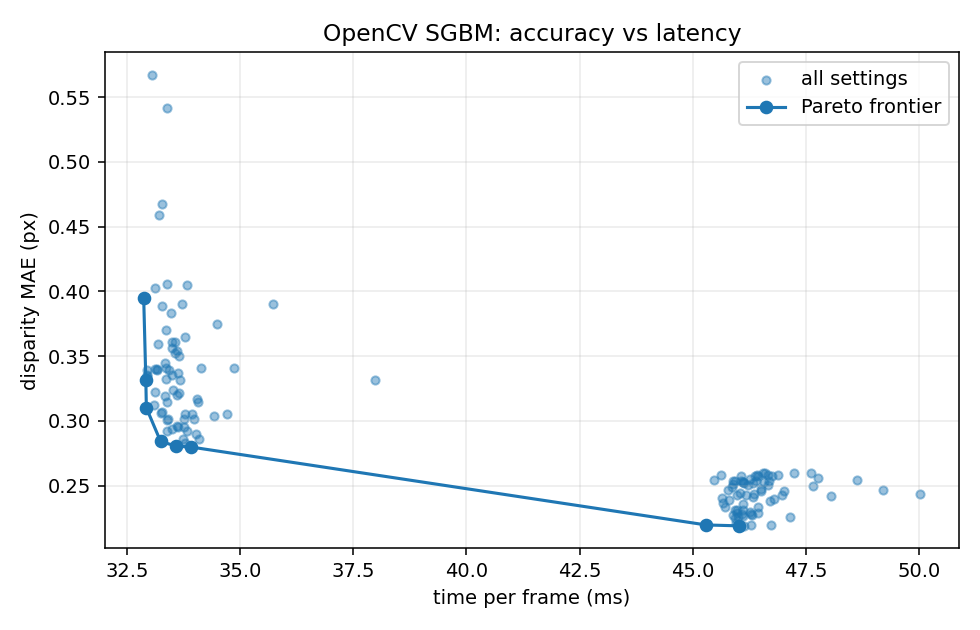

# stereo-sgm-benchmark

A harness for measuring stereo disparity matchers honestly: masked error
metrics, a synthetic pair with exact ground truth, parameter sweeps, and an
accuracy-versus-latency frontier.

Runs end to end on a fresh clone with no downloads and no GPU.

```bash
pip install -r requirements.txt
python -m pytest tests -q          # 21 tests, under a second
python cli.py evaluate             # compare matchers on a synthetic pair
python cli.py sweep --out results  # 144-setting grid, CSV and frontier plot
```

## Why this exists

Stereo results are usually reported as a single error number, which is not
enough to compare two matchers, because:

* **A matcher that declines to guess looks perfect.** Scoring only the pixels it
  estimated rewards refusing to estimate. Density has to be reported next to
  accuracy or either one can be gamed.
* **Occluded pixels have no right answer.** A pixel the second camera cannot see
  cannot be recovered by any algorithm, so including it measures the scene, not
  the matcher.
* **Accuracy without latency is half a result.** Any matcher can be made more
  accurate by being slower. What a robot needs is the frontier.

This harness makes all three explicit. Every metric is masked twice — by ground
truth validity and by whether the matcher produced an estimate — and every
result carries the time that produced it.

## Measured

Synthetic 640×480 pair, 64-pixel disparity range, 15% textureless patch. Apple
M-series, OpenCV 4.x, best of three runs:

| Matcher | MAE (px) | RMSE | bad-1.0 | bad-3.0 | Density | Time |
|---|---|---|---|---|---|---|
| OpenCV SGBM | **0.31** | 1.31 | 0.004 | 0.004 | 0.954 | 33 ms |
| OpenCV BM | 0.69 | 3.76 | 0.020 | 0.020 | 0.895 | 3.6 ms |

A 144-setting sweep over block size, the P1/P2 smoothness penalties, uniqueness
ratio, and path count produces this frontier:

| Time | MAE | bad-1.0 | Setting |
|---|---|---|---|
| 32.9 ms | 0.310 | 0.004 | block 5, P1 200, P2 800, uniqueness 15, 5-path |
| 33.9 ms | 0.280 | 0.003 | block 9, P1 392, P2 800, uniqueness 5, 5-path |
| **45.3 ms** | **0.220** | **0.000** | block 3, P1 392, P2 1568, uniqueness 10, **8-path** |

The readable conclusion: on this scene, **8-path aggregation is the only thing
on the grid that reaches MAE 0.220** — the best any 5-path setting manages is
0.280, and no combination of block size, penalty ratio, or uniqueness closes the
gap at any price. Path count dominates; the other three knobs move the result
far less.

**What the time column is worth, and what it is not.** Re-running the same
144-setting grid on a second machine (Apple M1, see
[`results/machines.md`](results/machines.md)) reproduces every accuracy figure
*bit-identically* — MAE 0.280 and 0.220 to three decimals, same settings — and
does not reproduce the timings at all:

| | 5-path best | 8-path best | time premium | MAE gain |
|---|---|---|---|---|
| reference | 33.9 ms | 45.3 ms | **+34%** | 21% |
| Apple M1 | 75.7 ms | 88.7 ms | **+17%** | 21% |

The accuracy gain is a property of the algorithm and transfers. The time premium
is a property of the machine and halves between two of them. So the honest form
of the conclusion is: *8-path buys the last 21% of accuracy, and you must
measure what it costs on your own target* — a latency budget set from someone
else's millisecond column is set from their memory subsystem, not yours.



## What the synthetic pair is for

The right image is built by warping the left one through a disparity field that
is chosen first, so ground truth is exact by construction rather than measured.
That makes it possible to test the harness itself: `tests/test_datasets.py`
verifies pixel by pixel that the right image agrees with the declared disparity,
because a generator whose images and labels disagree would silently corrupt
every number downstream.

The scene is three fronto-parallel slabs plus a ramp, which exposes the two
failure modes worth separating — discontinuities at the slab edges, and gradient
bias on the ramp — plus an optional textureless patch, since a benchmark that
never includes one overstates every matcher it tests.

Forward warping also produces genuine occlusion. Where disparity rises along a
row, several left pixels compete for one right column; the nearer surface wins
and the farther one is truly hidden. Those pixels are marked as having no ground
truth, so no matcher is penalised for failing to see through a surface.

For real data, `load_middlebury()` reads Middlebury 2014 scene directories,
including the PFM ground truth and its infinity-means-unknown convention.

## libSGM and CUDA

`matchers.LibSGM` is an adapter stub with the same signature as the OpenCV path,
so a sweep authored on a laptop re-runs unchanged on a GPU box. It needs a build
of [FiXSTARS libSGM](https://github.com/fixstars/libSGM) with Python bindings
and an NVIDIA device.

One practical note: upstream CMake pins the CUDA architecture. Building for a
device other than the one it was configured for fails or silently produces
nothing — set it to your card's compute capability (T4 is `sm_75`, Jetson TX2 is
`sm_62`).

OpenCV SGBM is **not** the same algorithm as libSGM: it aggregates over 5 paths
by default and uses a Birchfield–Tomasi cost, where libSGM uses census over 4 or
8. It is a stand-in that runs anywhere, not a reference implementation, and
results from it should not be reported as what SGM does.

## Layout

```
stereo_bench/
  metrics.py    masked error metrics, disparity-to-depth
  datasets.py   synthetic pair with exact truth, Middlebury + PFM loader
  matchers.py   OpenCV SGBM/BM adapters, libSGM stub, timing
  sweep.py      parameter grids, Pareto frontier, CSV and plots
cli.py          evaluate / sweep / middlebury
tests/          21 tests, mostly on the metrics and the generator
```

The metrics and the generator carry most of the tests, on the principle that
they are what every other number rests on: a quiet bug in either one rewrites
all the results without ever failing loudly.

## License

MIT
